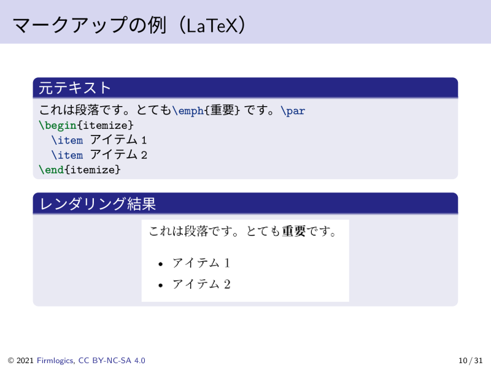
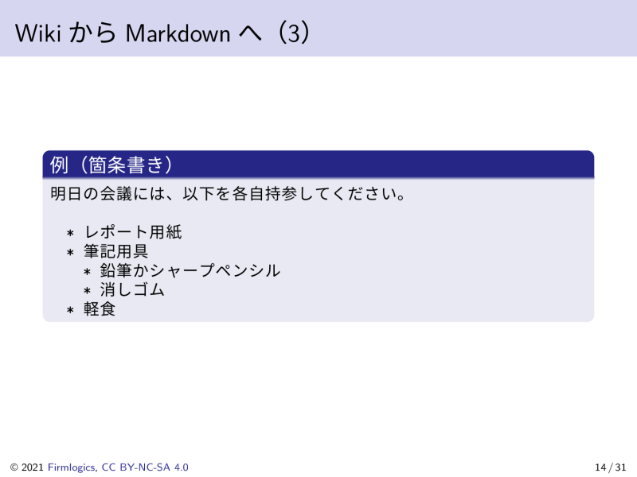
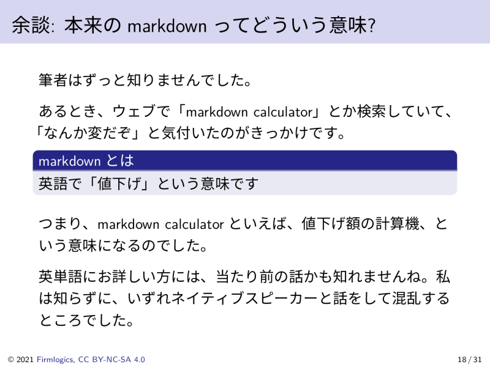
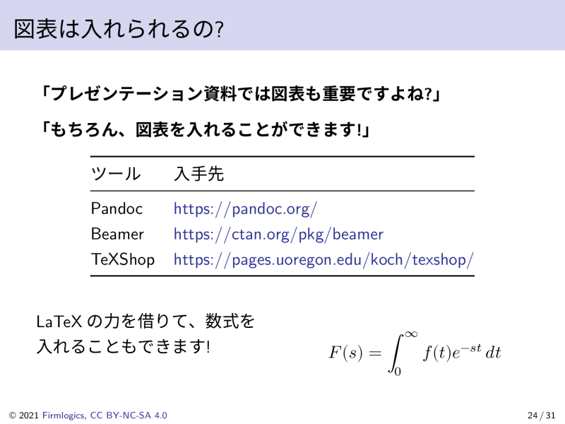

# Markdownでプレゼンテーションをしよう（Pandoc + Beamer編）

(Yet another) how to create presentation slides by Markdown (Pandoc + Beamer version).
Written in Japanese.

世の中にはたくさんの優れたサンプルがありますが、私も一つ書いてみました。

## 必要なツール

- [Pandoc](https://pandoc.org/)
- [TeX Live](https://www.tug.org/texlive/)

## あると便利なツール

- make
- latexmk

## スライドの作成方法

```bash
$ make
```

## 入力ソースコード（Markdown形式）

- [slides.md](slides.md)

## 出力例

### PDF

- [PDF slides](output/presentation_by_pandoc_beamer_slides.pdf)

### PNG














