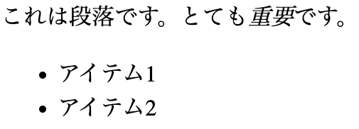
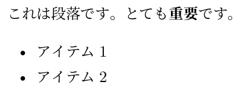

## どうやってプレゼンしてますか?（1）

企業の技術者や研究者の皆様、さらには営業職、管理職の皆様も、日頃からプレゼンテーション資料の作成に追われる日々かと思います。

## どうやってプレゼンしてますか?（2）

ふだん、どんなツールでプレゼンをしていますでしょうか?

- **OHP（オーバー・ヘッド・プロジェクタ）シートに手書き**

  さすがに、これは見なくなりました。

- **OHPにプリンタで印刷（セロハン紙を貼ったりしてね…）**

  昔はよく、学会で見ました。

- **Microsoft PowerPointとプロジェクタ**

  これが最近の主流ではないでしょうか?

## PowerPointが嫌になることはありませんか?（1）

**「みんなパワポだし、しょうがないんじゃない?」**

…でも、PowerPointって生産性が低いですよね。

## PowerPointが嫌になることはありませんか?（2）

- **履歴管理、差分管理ができない（面倒）!**

  - 先日、A社さん向けにプレゼンをカスタマイズしたんだけど、オリジナルとどこが違うのか分からなくなっちゃった。
  - プレゼンを更新したの? 私のにも差分を反映したいなあ。

- **全体のスタイルを統一するのが面倒!**

  - あれ? フォントをヒラギノに変えたはずなのに、タイトル行だけMSゴシックのままだよ。
  - 日付を更新したはずなのに、表紙の日付しか直ってない!

- **内容の執筆に集中できない!**

  - 資料を書いているはずなのに、レイアウトが気になって直してばかりいる…
  - マウス操作が面倒。キーボードだけでバリバリ執筆したい。

## Markdownお使いですか?（1）

近年、技術資料のフォーマットは、従来のMS-Word、Excel、PDFなどから、HTMLなどウェブ技術をベースとしたものに移行してきました。

**利点**:

- ウェブサイトで閲覧や検索をしやすい
- ウェブサイトのレイアウトを保ちやすい
- スマートフォンの小さな画面でも見やすい
- Gitなどによる履歴管理がしやすい

## Markdownお使いですか?（2）

**「HTMLで直接資料を書くのは大変でしょう?」**

**「Markdownなら簡単です!」**

皆様も、
[GitHub](https://github.com/)
や
[GitHub Gist](https://gist.github.com/starred)
などで技術資料を閲覧することはあるのではないでしょうか。

これらサイト上の技術文書は、多くがMarkdownで書かれています!

## Markdownお使いですか?（3）

**「マークアップなら知ってるけど、Markdownってなに?」**

- マークアップ言語として有名なものは、HTML（HyperText Markup Language）、XML（eXtensible Markup Language）、TeX（あるいはLaTeX）などではないでしょうか。

- これらはいずれも、テキスト形式の文書にさまざまなコマンド（タグ）を埋め込むことで、文書に機械可読な文書構造や装飾を持たせるためのものです。

## マークアップの例（HTML）

### 元テキスト

```html
<p>これは段落です。とても<em>重要</em>です。</p>
<ul>
  <li>アイテム1</li>
  <li>アイテム2</li>
</ul>
```

### レンダリング結果

{width=50%}

## マークアップの例（LaTeX）

### 元テキスト

```latex
これは段落です。とても\emph{重要}です。\par
\begin{itemize}
  \item アイテム1
  \item アイテム2
\end{itemize}
```

### レンダリング結果

{width=50%}

## マークアップ言語の欠点

マークアップ言語では、テキスト形式の文書に厳密な文書構造を持たせることが可能ですが、以下のような欠点があります。

- 文書を執筆する際に、文書の内容に集中できない。（テキスト中のマークアップが目障り）
- マークアップのコマンド（タグ）を覚えるのが面倒。
- マークアップを取り除いてプレインテキストにしたり、他の文書フォーマット（MS-Wordなど）に変換するのが面倒。（現在は、優れたツールで自動化できます）

## WikiからMarkdownへ（1）

1995年、Ward Cunninghamという技術者が
[WikiWikiWeb](https://wiki.c2.com/)
というツールとウェブサイトを公開しました。

WikiWikiWeb（省略してWikiとも呼ばれる）は、（1）構造化され、（2）ハイパーリンクを含むウェブサイトを、技術者でない人でもHTMLを覚えることなく構築できる素晴らしいアイデアで、当時、類似のツールがたくさん作られました。

### 余談
ちなみに有名な**Wikipedia**は、Wikiの技術を応用してウェブ上に百科事典を作ろうとしたプロジェクトの名称です。
そのため、WikipediaをWikiと省略するのは、厳密には誤りです。

## WikiからMarkdownへ（2）

プレインテキストが主流の電子メールの世界では、読み手に見やすいフォーマットで文章を書くという習慣があります。

### 例（セクション名, 字下げ）

```
会議の議題
----------

   会議の議題は、新入社員研修の改革についてです。

会議室
------

   第2会議室
```

## WikiからMarkdownへ（3）

### 例（箇条書き）

```
明日の会議には、以下を各自持参してください。

  * レポート用紙
  * 筆記用具
    * 鉛筆かシャープペンシル
	* 消しゴム
  * 軽食
```

## WikiからMarkdownへ（4）

WikiWikiWebやMarkdownのテキストフォーマットのアイデアは、

**「人間がこのような文書の構造を理解できるのなら、コンピュータに解釈させることも可能なのでは?」**

というものです。

## WikiからMarkdownへ（5）

- Markdownでは、マークアップのためのコマンドを使うことなく、字下げや改行、また、簡単な記号を使うだけで、プレインテキストに文書構造や装飾を持たせ、それを機械可読にすることで、コンピュータがレンダリングすることができます。

- Markdownは機械可読なので、自動化ツールを使うことで、Markdownフォーマットの文書をHTMLやTeX、あるいはMS-Wordの
.docx形式、さらにはPDF文書に変換することが可能です。

## Markdownの例

### 元テキスト

```markdown
これは段落です。とても**重要**です。

  * アイテム1
  * アイテム2
```

<!--
Refer https://github.com/jgm/pandoc/issues/2957
Refer https://stackoverflow.com/questions/4823468/comments-in-markdown
-->
::: block
### レンダリング結果

これは段落です。とても**重要**です。

  * アイテム1
  * アイテム2

:::

HTMLやLaTeXは面倒でも、これなら覚えられそうですね!
（詳細なフォーマット例は[こちら](https://github.com/adam-p/markdown-here/wiki/Markdown-Cheatsheet)で見られます。）

## Markdownでプレゼン資料を作れないの?

- TeXの世界では、かつてSliTeXと呼ばれるマクロパッケージがあり、硬派な技術者はマークアップ言語でプレゼンテーション資料（slide）を作っていました。（1990年頃?）

  しかし表現力が弱く、図表を多用した見栄えのするプレゼンテーションを作成するのは困難でした。

- その後、強力な図表作成環境が充実してきたことに加え、後述の変換ツールPandocやマクロパッケージBeamerが登場してきたことにより、Markdownでプレゼンテーション資料を作ろうという機運が、再び高まっています。

## Pandocってなに?

MarkdownやHTML、MS-Word、LaTeXなどで記述された文書を相互に変換することのできるツールです。

- [こちらのサイト](https://pandoc.org/)を見ると、どのようなフォーマット間で変換が可能か分かります。

- 例えば、皆さんが仕事のアイデアやプレゼンのネタなどをMarkdownで書き散らしておいたものを、HTMLに変換してウェブで公開したり、LaTeXに変換して綺麗なPDFを作成したりできます。さらに、MS-Wordに変換すれば、MS-Wordしか使わない上司を安心させることができます。

## Beamerってなに?（1）

[Beamer](https://ctan.org/pkg/beamer)
は元々、LaTeXと呼ばれる組版ソフトウェア（マークアップ言語）を使ってプレゼンテーション資料を作成するための、ライブラリ（document class）です。
前述のSliTeXの発展系と言えるでしょう。

- LaTeXを御存知の方であれば、数時間で簡単なプレゼンテーション資料を作れるようになります。

- 多くのテーマや配色の組み合わせがいろいろ用意されているので、自分の気に入ったレイアウトに簡単に変更可能です（[参考](https://hartwork.org/beamer-theme-matrix/)）。自分でテーマをデザインすることもできるので、組織やグループでプレゼン資料のレイアウトを統一することもできるでしょう!

## Beamerってなに?（2）

Beamerで作成されたプレゼンテーションの例として、秀逸なものに
[Buildroot](https://buildroot.org/)プロジェクトの資料があります。
[こちら](https://buildroot.org/docs.html)で閲覧できます。

### 余談
私がBeamerを試してみようと思ったきっかけは、このプレゼンテーション資料の存在です。

## Beamerってなに?（3）

**「LaTeXは分からないけど、Pandocと組み合わせればMarkdownでプレゼン資料を作れるのでは?」**

**「その通りです!」**

もはや、簡単なプレゼンテーション資料であれば、PowerPointのレイアウトで苦戦したり、LaTeXの構文を覚えたりせずに、PDF形式の美しいプレゼンテーション資料が作れるのです。

### もちろん!

このプレゼン資料もPandoc${}+{}$Beamerで作られています。
ぜひ、Markdownで書かれたテキスト（ソースコード）と、このプレゼンを見比べてみてください!

## 図表は入れられるの?

**「プレゼンテーション資料では図表も重要ですよね?」**

**「もちろん、図表を入れることができます!」**

<!--
{width=30%}
-->

ツール  |  入手先
------- | -------
Pandoc  | [https://pandoc.org/](https://pandoc.org/)
Beamer  | [https://ctan.org/pkg/beamer](https://ctan.org/pkg/beamer)
TeXShop | [https://pages.uoregon.edu/koch/texshop/](https://pages.uoregon.edu/koch/texshop/)

::: columns

:::: column

LaTeXの力を借りて、数式を入れることもできます!

::::

:::: column

$$F(s)=\int_0^\infty f(t)e^{-st}\,dt$$

::::

:::

## マクロとか使えたら良いのに…

**「マクロプロセッサが使えたら良いのにね!」**

**「使えます!」**

こんなツールがあります。

- [GitHub: CDSoft/pp](https://github.com/CDSoft/pp)

変数定義、参照、条件判断などができます。
その他に、テキストベースによるUMLダイアグラム、状態遷移図、ベクトル形式のグラフの作成、埋め込みができます。

### 今後の課題

いつか、このツールも御紹介したいと思います。

## Pandoc, Beamerの詳細はここにあります

- [Pandoc a universal document converter](https://pandoc.org/)

- [Overleaf: Beamer](https://www.overleaf.com/learn/latex/Beamer)

## Markdownの注意点

Markdownの構文には、厳密に定義されたものがありません。少しずつ異なる方言がたくさんあります。

現在、良く知られた定義や実装には、以下があります。

- John GruberさんがPerl言語で書いたオリジナル実装
- Pandocによる定義と実装
- GitHubによる定義と実装
- CommonMark（Markdownを厳密に定義しようという試み）

## おまけ: ウェブブラウザでプレゼンはできないの?

Markdown形式で記述した資料をHTMLに変換し、JavaScriptの力を借りてプレゼンテーションするツールもあります。

PowerPointのように、アニメーション効果を持つプレゼンテーションを作れます。

**詳しい説明やデモ**:

- [Markdown pandoc slides: easy and quick ways to create slides from markdown with pandoc](https://geekoverdose.wordpress.com/2018/12/10/2628/)

- [Pandoc Demos（Example 16: HTML slide shows）](https://pandoc.org/demos.html)

## まとめ

- 近年、技術文書を**Markdown**で書くことが流行しています。

  - 見た目ではなく、文書の構造と内容に集中できます。
  - 使い慣れたテキストエディタで編集できます。

- 一度Markdownで書けば、**Pandoc**を使って、HTMLやLaTeX、MS-Wordに簡単に変換できます。

- **Beamer**を使えば、Markdownでプレゼンテーション資料だって作れます。

- 仕事を、もっともっと**生産的**にしていきましょう!

## Back-up
